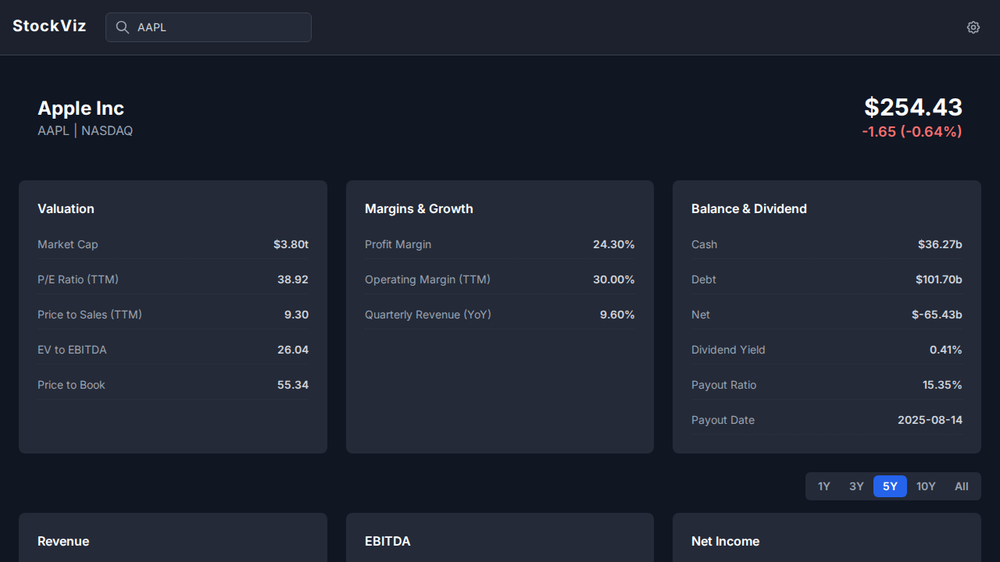

# Stock Fundamentals Visualizer

This is a web application that allows you to visualize fundamental stock data for any company. It uses the AlphaVantage API to fetch data and displays it in an intuitive and interactive dashboard.

## Screenshot



## Features

- **Company Overview**: Get a snapshot of the company's profile, including its sector, industry, and a brief description.
- **Financial Charts**: Visualize key financial metrics over time, including:
  - Stock Price
  - Revenue
  - EBITDA
  - Net Income
  - Free Cash Flow
  - Total Assets
- **Time Range Filtering**: Adjust the time range for the charts (1Y, 3Y, 5Y, 10Y, All).
- **Insider Transactions**: View recent insider buy transactions.
- **Responsive Design**: The application is designed to work on different screen sizes.

## How to Run Locally

**Prerequisites:**

- [Node.js](https://nodejs.org/) installed on your machine.
- An API key from [AlphaVantage](https://www.alphavantage.co/support/#api-key).

**Steps:**

1.  **Clone the repository:**
    ```bash
    git clone <repository-url>
    cd <repository-directory>
    ```

2.  **Install dependencies:**
    ```bash
    npm install
    ```

3.  **Run the application:**
    ```bash
    npm run dev
    ```
    The application will be running at `http://localhost:5173` (or another port if 5173 is in use).

4.  **Set your API Key:**
    - Once the application is running, you will see an input field in the header to enter your AlphaVantage API key.
    - Paste your key there and click "Save". The key will be stored in your browser's local storage for future use.

## Technologies Used

- **React**
- **TypeScript**
- **Vite**
- **Tailwind CSS**
- **Recharts** for charting
- **AlphaVantage API** for financial data
